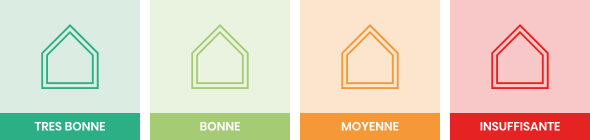

## 💡 Performance de l'enveloppe

Les **déperditions** thermiques d'un bâtiment sont liées à la qualité de son enveloppe : son isolation. Elles déterminent directement le **besoin en chauffage** et donc sa **consommation d'énergie**. Une enveloppe mal isolée ou perméable aux infiltrations d'air entraîne des pertes de chaleur importantes, augmentant les besoins énergétiques et les coûts. À l’inverse, une enveloppe performante réduit ces déperditions, limite les consommations et améliore le confort des occupants, été comme hiver.

### Performance thermique et Ubat

**Ubat** est le **coefficient de déperidition thermique** du bâtiment. C'est l'indicateur clé pour évaluer la performance de l'enveloppe. Il représente la quantité de chaleur perdue par m² pour 1°C de différence entre l’intérieur et l’extérieur. Plus Ubat est bas, moins le bâtiment perd de chaleur. Au contraire un Ubat élevé indique une mauvaise isolation et donc des déperditions importantes.

La performance de l'enveloppe est représentée par cet indicateur :

Une rénovation performante doit permettre d'atteindre une **bonne performance de l'enveloppe** afin de réduire le besoin de chauffage. Pour cibler les priorités, il faut regarder du côté de la répartition des déperditions.

### Confort d'été

Le **confort d’été** dépend de la capacité d'un bâtiment à limiter les effets d'une surchauffe. Il dépend de l'exposition de l'enveloppe aux apports solaires, mais aussi de l'inertie du bâtiment et de son isolation. Ce sont ces facteurs qui vont déterminer le **besoin de refroidissement** et donc sa **consommation d'énergie**.

Le confort d'été est représenté par cet indicateur :

Pour l'améliorer, plusieurs solutions :

- **Préserver l'inertie du bâtiment** en utilisant par exemple des matériaux d'isolation adaptés
- **Améliorer l'isolation de la toiture** qui est la paroi la plus exposée aux apports solaires
- **Installer des protections solaires** pour réduire les apports solaires en été
